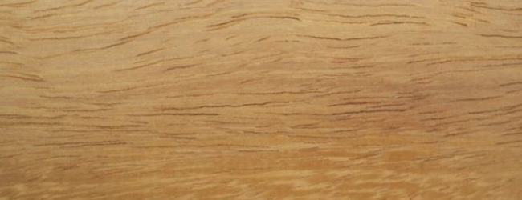
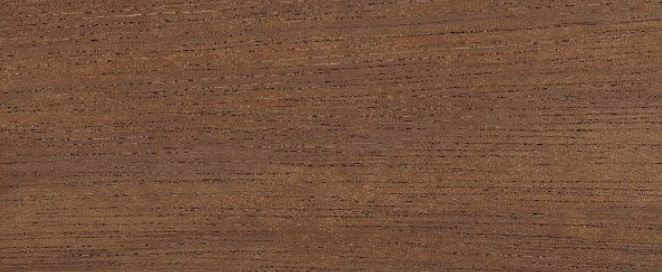
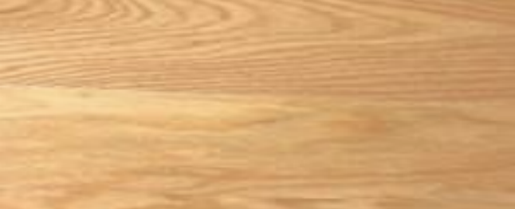

# Timber
Our designs can be made in a variety of timber choices

## Sapele
Sapele (Entandrophragma Cylindricum), is a
Tropical Hardwood
also known as Gold Coast Cedar & Penkwa.

The heartwood has a medium to dark reddish-brown colour, characterised by a well-defined
ribbon striped figure on quartered surfaces. Sometimes, when wavy grain is present,
a mottled figure is obtained.

## Iroko
Iroko (Chlorophora Excelsa)
is a Tropical Hardwood
also known as Odum, Mvule, Kambala, Bang,
Moreira, Tule and Intule.

The heartwood is usually a yellow to golden or medium brown, with colour tending to darken
over time. Pale yellow sapwood is clearly demarcated from the heartwood. Iroko has a medium to coarse
texture with open pores and an interlocked grain.

## Utile
Utile (Entandraopragma Utile)
is a Tropical Hardwood
also known as Tshimage Rosso, Medbrou
Zuiri, Kosi-kosi and Afau-konkonti

The heartwood matures from a pink-brown when fresh cut to deep red-brown. The grain is
interlocked to rather irregular, producing a wide irregular striped figure on quartered surfaces.

## European Oak
European Oak
(Family Quercus Robur)
is a
Temperate Hardwood
also known as Rovere, Quercia, Chene & Eiche.

European Oak’s heartwood is light tan to biscuit coloured, usually straight grained, but
irregular or cross-grained material can occur depending on growth conditions. Characteristics silver grain
figure on quartered surfaces due to broad rays.
