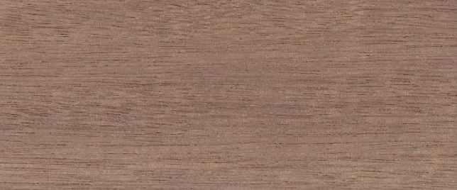

# Timber
Our designs can be made in a variety of timber choices
## Sapele
Sapele (Entandrophragma Cylindricum), is a
Tropical Hardwood
also known as Gold Coast Cedar & Penkwa.

The heartwood has a medium to dark reddish-brown colour, characterised by a well-defined
ribbon striped figure on quartered surfaces. Sometimes, when wavy grain is present,
a mottled figure is obtained.
